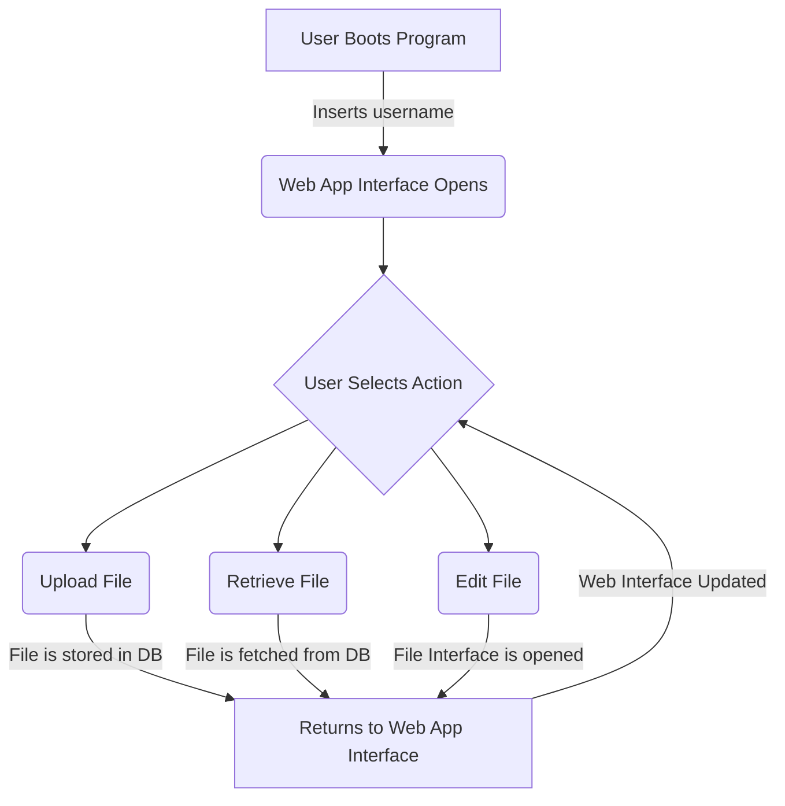
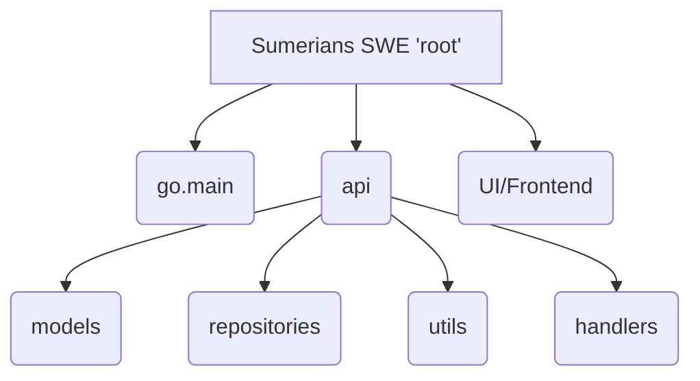

# SWE-Sumerians
A repository for creating a simple DMS software

## The general work flow idea

## File Structure for the Project

go.main is the root of the project which coordinates the UI (a react app) with the assorted types of RESTful API calls needed (all of which are put into a folder rather than having individual folders for handlers, models, etc. 

## Tools That We are Using

### Backend
Make sure if you are working on the backend you have these installed. 

- Go version 1.24
- Fiber: https://github.com/gofiber/fiber

