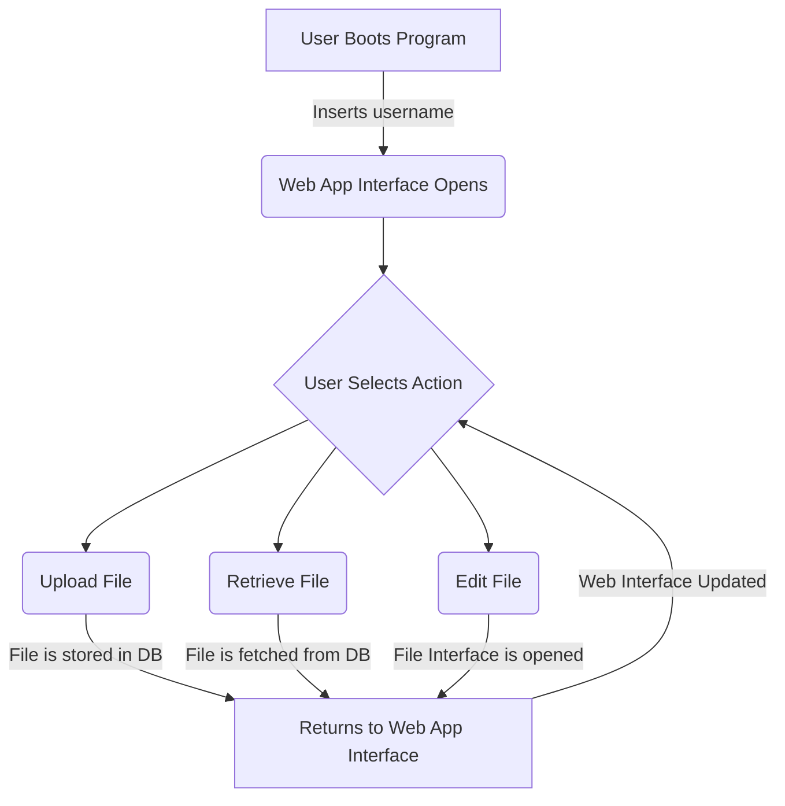

```mermaid
flowchart TD;
    A[User Boots Program] -->|Inserts username| B(Web App Interface Opens);
    B --> C{User Selects Action};
    C --> D(Upload File);
    C --> E(Retrieve File);
    C --> F(Edit File);
    D -->|File is stored in DB| G[Returns to Web App Interface];
    E -->|File is fetched from DB| G;
    F -->|File Interface is opened| G;
    G -->|Web Interface Updated| C;
```
